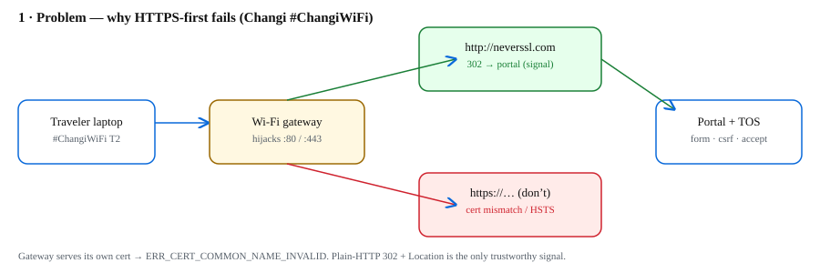
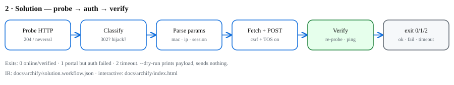
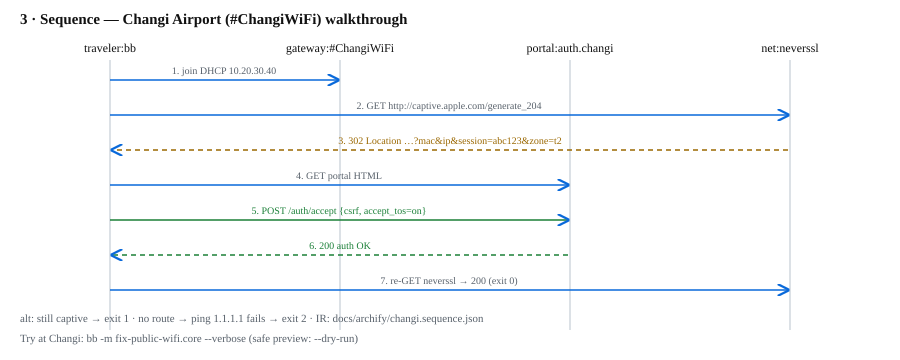

# fix-public-wifi

> **Status:** Maintenance — stable, security fixes only.

Babashka/Clojure CLI that detects captive portals over **plain HTTP**, assists with the portal's own TOS/login form on networks you own or are explicitly authorized to use, and verifies access. Zero external deps. `MIT`.

## Authorized use only

- Run only on networks you own, administer, or have explicit permission to test (home lab, office guest net with IT approval).
- On unknown networks default to preview mode first — it sends nothing:
- The tool only submits the portal's own published TOS form (the same click you would do in a browser). No credential bypass, no tunneling, no evasion.

## Diagrams (archify)

Diagrams below are rendered from versioned, typed JSON IR in [`docs/archify/`](docs/archify/) — deterministic SVG checked into the repo, following the method of [tt-a1i/archify](https://github.com/tt-a1i/archify) (typed IR → verifiable diagrams, no auto-layout guessing). Interactive offline viewer: [`docs/archify/index.html`](docs/archify/index.html) (dark/light with `T`).

### 1 · Problem — why `https://`-first probing fails



Gateway serves its own cert for foreign hostnames → `ERR_CERT_COMMON_NAME_INVALID` / HSTS. Plain-HTTP `302 + Location` is the only trustworthy signal. IR: [`problem.architecture.json`](docs/archify/problem.architecture.json).

### 2 · Solution — probe → auth → verify



Exits: `0` online/verified · `1` portal but auth failed · `2` timeout. IR: [`solution.workflow.json`](docs/archify/solution.workflow.json).

### 3 · Sequence — Changi Airport walkthrough



IR: [`changi.sequence.json`](docs/archify/changi.sequence.json). Full transcript: [`docs/CHANGI_EXAMPLE.md`](docs/CHANGI_EXAMPLE.md).

## Worked example: airport TOS-accept flow (walkthrough of a standard portal flow observed on a public network)

Joining the airport Wi-Fi with no route yet (all steps below are the portal's own published form):

1. `bb -m fix-public-wifi.core --verbose`
2. CLI GETs `http://captive.apple.com/generate_204` (no TLS, redirects disabled).
3. Gateway hijacks port 80 → `302 Location: http://auth.changi/login?mac=AA:BB&ip=10.20.30.40&session=abc123&zone=t2`.
4. CLI GETs that landing page, extracts `<form action="/auth/accept">`, hidden `csrf=tok-123`, and the `accept_tos` checkbox.
5. CLI POSTs `{csrf, mac, accept_tos=on}` with the gateway cookie.
6. CLI re-probes `http://neverssl.com` → clean `200 NeverSSL` → **exit 0**. Still hijacked → **exit 1**. No route at all → ping `1.1.1.1` fails → **exit 2**.

Safe preview on any network (sends nothing — use this first on networks you don't administer):

```sh
bb -m fix-public-wifi.core --dry-run --verbose
bb -m fix-public-wifi.core --probe-only
```

## Usage

```sh
bb -m fix-public-wifi.core --help
bb -m fix-public-wifi.core --verbose
bb -m fix-public-wifi.core --probe-url http://neverssl.com --timeout 8
bb --portal-url "http://auth.example/login?session=x" --dry-run
```

Exit codes: `0` online/verified · `1` portal detected but auth failed · `2` network timeout.

CLI parsing supports **both** built-ins (`babashka.cli` preferred, `clojure.tools.cli` fallback, manual last resort) — see `src/fix_public_wifi/cli.clj`.

## Layout

```
bb.edn  src/fix_public_wifi/{core,probe,portal,verify,cli}.clj
test/fix_public_wifi/{probe,portal,cli}_test.clj  docs/archify/  LICENSE (MIT)
```

## License

MIT. See [LICENSE](LICENSE). Copyright (C) 2026 nurazhardotcom.
